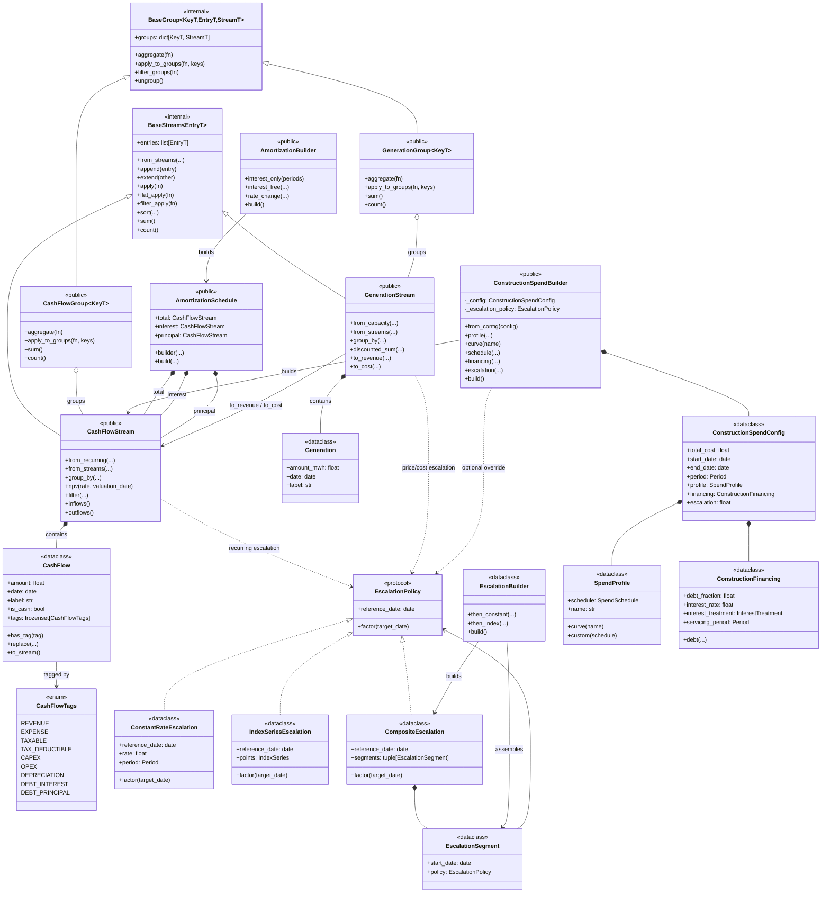
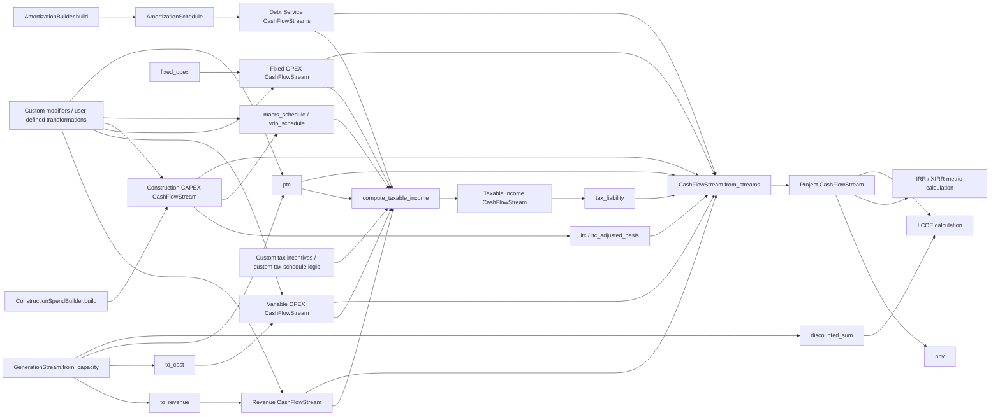
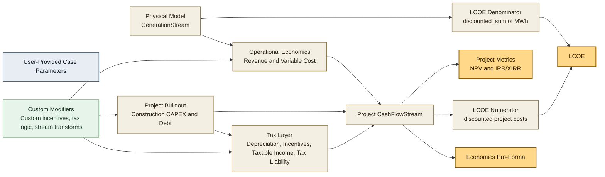

# DCAF Architecture Diagram

This page is presentation-oriented. It shows the main public types, how they relate, and what the current library shape suggests about project maturity.

## Class Diagram

## Usage Flow

## Slide-Friendly Usage View

Use this version when you want to emphasize the architecture in six ideas instead of many concrete functions:

- `Physical Model`: generation is modeled separately from money.
- `Operational Economics`: generation is converted into revenues and variable operating costs.
- `Project Buildout`: construction spend and financing create CAPEX and debt-service streams.
- `Tax Layer`: depreciation and incentives affect taxable income and tax liability.
- `Custom Modifiers`: the library is designed to accept additional user-defined transformations by composing streams.
- `Project Metrics`: the assembled project stream drives valuation metrics, while LCOE also depends on discounted generation.

## Current State

- The core library shape is stable and modular: `CashFlow` and `Generation` are the atomic records, while `CashFlowStream` and `GenerationStream` are the main composition layer.
- Builder usage is selective and intentional. More stateful domains use builders (`ConstructionSpendBuilder`, `AmortizationBuilder`); simpler domains stay as pure functions (`fixed_opex`, `ptc`, `itc`, `tax_liability`, depreciation helpers).
- Escalation is one of the strongest design abstractions in the codebase. A shared `EscalationPolicy` protocol is reused across recurring cashflows, generation pricing, and construction spend.
- The repo currently looks like a well-tested financial toolkit rather than a single top-level project model or pro-forma engine. That is an inference from the public API shape: many composable primitives, no central `Project` or `Model` aggregate object.
- Extension points exist mostly through composition rather than subclassing. In practice, “custom modifiers” are additional functions or stream transformations that produce or modify `CashFlowStream` objects before they are merged into the project model.
- Depreciation is modeled explicitly as non-cash `CashFlowStream` output (`macrs_schedule`, `vdb_schedule`) that feeds taxable income rather than project cash NPV directly.
- LCOE is supported conceptually by the current primitives: use the project-level cost cashflows as the numerator and `GenerationStream.discounted_sum()` as the discounted MWh denominator.
- IRR is listed in the repo requirements/readme, but there is no public `irr()` helper in the current library code. For presentation purposes, it is best shown as a metric calculated from `Project CashFlowStream`, but it appears to still be an integration-layer or roadmap item rather than a shipped API.
- Test maturity is good for this layer: `uv run pytest -q` currently passes with `408 passed`, and the tests are spread across cashflows, generation, construction, escalation, depreciation, tax incentives, tax liability, and amortization.

## Presentation Framing

- If you need to explain the design in one sentence: DCAF is built around immutable financial and physical records, typed stream containers, reusable escalation policies, and builder APIs only where configuration complexity justifies them.
- If you need to explain where development stands: the domain primitives and schedule generators are in strong shape, extension by composition is already possible, and the remaining gap is higher-level integrated metrics such as first-class IRR/LCOE workflows.
